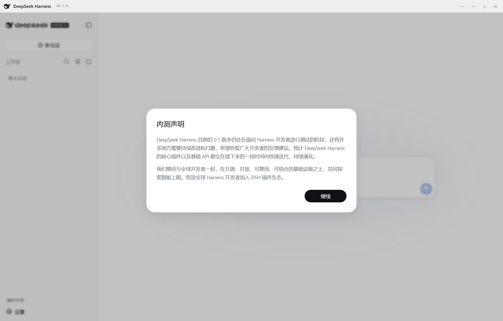

# DeepSeek Harness Desktop（Windows）

把 [DeepSeek Harness](https://github.com/deepseek-ai/deepseek-harness)（DSH）装进 Windows 桌面的应用。**不用安装 Node.js、不用敲命令**，双击启动即用，官方 DSH 的 Web 界面与插件生态完整保留。

[](https://github.com/Easyhoov/deepseek-harness-desktop-windows/releases)
[](LICENSE)

> ⚠️ **非官方**：本项目与 DeepSeek 无任何隶属或背书关系，仅对开源发行版 `@deepseek-ai/dsh` 做桌面封装。

---

## 核心特性

- **零配置启动** — 自带 DSH 运行时，无需 Node.js / pnpm，装完即用
- **进程内集成** — 宿主在应用内部启动：零端口、零子进程、无本地 HTTP 服务；关闭窗口（驻留托盘）会话不中断
- **完整 Web UI** — 官方 DSH 界面无损加载：会话、工具、审批、轨迹、任务看板等全部可用
- **插件生态** — 官方 `dsh plugin add` 机制，支持 npm 包 / GitHub 仓库 / monorepo 子目录 / 本地 tarball；内置社区插件商店（ZASENJC 插件商店）
- **一键更新** — 自动检查更新，下载显示实时进度，退出时自动安装，全程有反馈
- **桌面增强** —
  - 系统托盘常驻 + 原生通知（回复完成、审批、更新就绪）
  - 会话余额实时显示（¥ + 本轮成本）
  - 文件改动追踪与一键还原
  - 崩溃自动恢复
- **一切皆插件** — 桌面功能本身就是标准 DSH 插件（bundle + 声明式补丁），与 profile 组合，可被 `dsh web` 识别



## 安装

从 [GitHub Releases](https://github.com/Easyhoov/deepseek-harness-desktop-windows/releases/latest) 下载最新版安装包（Windows 10/11，x64），双击安装即可。

## 快速开始

1. 安装并启动应用
2. 首次启动选择数据目录：独立目录（默认）或复用命令行 dsh 的 `~/.dsh`
3. 在 **设置 → 模型** 配置模型 API
4. 开始对话；需要扩展时去 **设置 → 插件 → 插件商店** 安装插件

## 插件

在应用内打开 **设置 → 插件 → 插件商店**（或输入 `/store`），浏览社区插件并一键安装；安装完成后重启应用生效。

也可以命令行安装（与 `dsh web` 同一套机制，共用同一个 profile）：

```sh
dsh plugin --profile web add <包名>
dsh plugin --profile web add github:<仓库>
```

## 更新

应用启动后自动检查更新，也可在右上角 **⋯ → 检查应用更新** 手动检查。下载显示进度，退出时自动安装，装完自动重启。

## 从源码构建

需要 Node.js ≥ 20：

```sh
npm ci
npm start       # 开发运行
npm run dist    # 构建安装包（输出到 release/）
```

## 项目结构

- `src/` — Electron 主进程：进程内宿主、IPC 桥、桌面补丁、托盘、更新器
- `plugins/` — 桌面插件（余额、文件改动）
- `scripts/` — 构建与工具脚本
- `docs/` — 文档与 DSH 开发文档归档

## 更多

- [更新日志](CHANGELOG.md)
- [English README](README_en.md)
